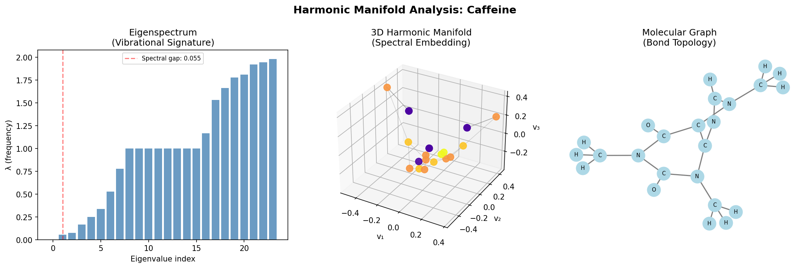
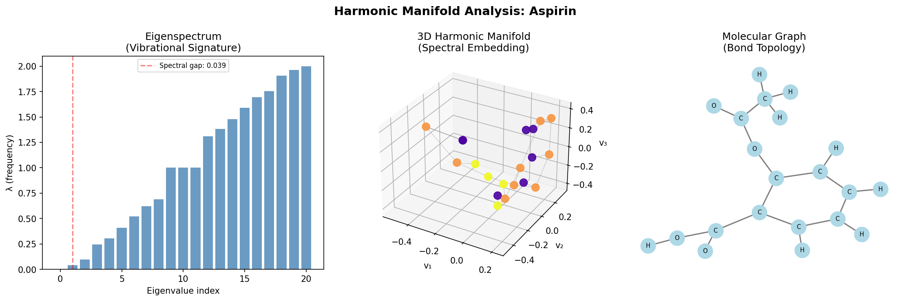
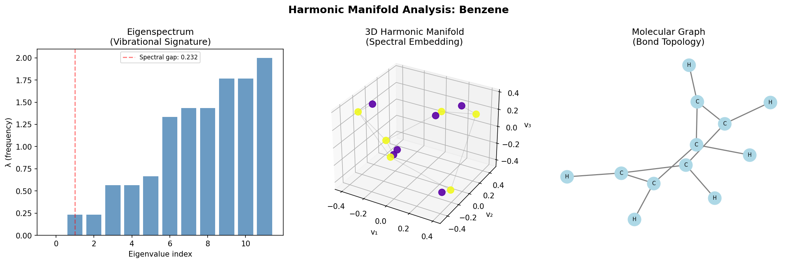
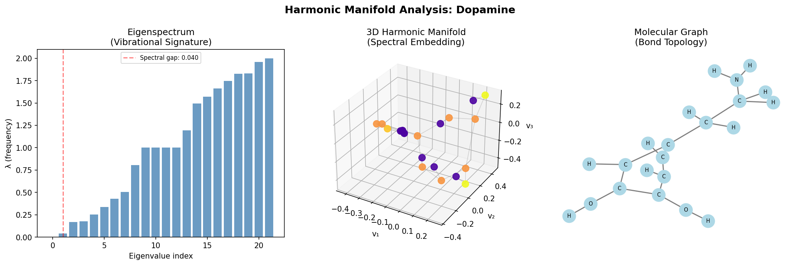
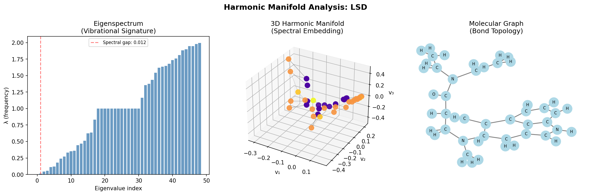
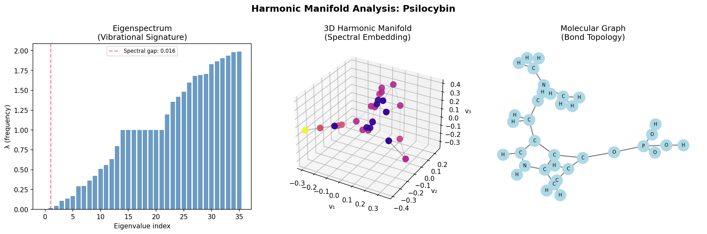

# Harmonic Manifolds: Spectral Analysis of Molecular Graphs

A computational framework for analyzing molecular structures through the lens of spectral graph theory and harmonic analysis. This project transforms chemical compounds into graph representations and applies Laplacian eigendecomposition to reveal intrinsic geometric and topological properties.

## Overview

This pipeline implements a spectral approach to molecular analysis by treating molecules as weighted graphs where atoms are nodes and bonds are edges. By computing the normalized graph Laplacian and its eigendecomposition, we extract a "vibrational signature" that characterizes the molecule's structural rigidity, connectivity, and reactive potential.

## Theoretical Foundation

### Graph Laplacian

The normalized graph Laplacian is defined as:

```
L = I - D^(-1/2) A D^(-1/2)
```

where:
- `A` is the adjacency matrix (bond connectivity)
- `D` is the degree matrix (number of bonds per atom)
- `I` is the identity matrix

### Spectral Properties

- **Eigenvalues (λ)**: Represent the "resonant frequencies" of the molecular graph
- **Eigenvectors**: Define a coordinate system aligned with the graph's harmonic modes
- **Spectral Gap**: The difference between the first and second smallest eigenvalues (λ₁ - λ₀)
  - High gap (>0.3): Rigid, well-connected structures (e.g., aromatic rings)
  - Low gap (<0.3): Flexible, loosely connected structures

### Spectral Embedding

The Laplacian eigenmap uses eigenvectors 1-3 as (x, y, z) coordinates, embedding the molecular graph into 3D space such that bonded atoms are positioned close together. This representation is both rotation and translation invariant.

## Architecture

### ChebConv Layer

Implements spectral graph convolution using Chebyshev polynomial approximation:

```
T₀(L̃) = I
T₁(L̃) = L̃
Tₖ(L̃) = 2L̃Tₖ₋₁ - Tₖ₋₂
```

where `L̃` is the scaled Laplacian with eigenvalues in [-1, 1].

### SpectralGNN

A two-layer Chebyshev convolutional network followed by global mean pooling and an MLP head for property prediction. The model operates directly in the spectral domain, making it naturally invariant to node permutations.

## Features

- SMILES to graph conversion with hydrogen enrichment
- Normalized Laplacian computation
- Eigendecomposition and spectral analysis
- 3D spectral embedding visualization
- Chebyshev spectral graph neural network
- Multi-molecule comparative analysis

## Requirements

```
numpy
torch
scipy
matplotlib
networkx
rdkit
```

## Usage

```bash
python pipeline.py
```

The pipeline analyzes six molecules (Caffeine, Aspirin, Benzene, Dopamine, LSD, Psilocybin) and generates:

1. Eigenspectrum plots showing vibrational signatures
2. 3D spectral embeddings in harmonic manifold space
3. Traditional molecular graph visualizations
4. Spectral gap analysis and structural classification

## Example Output

```
────────────────────────────────────────
Molecule : Caffeine
Atoms    : 24
Spectral Gap: 0.0546  (flexible/reactive)
Saved: caffeine_dashboard.png
Model output (untrained): 0.3317
```

### Generated Visualizations

Each molecule produces a three-panel dashboard:








## Results Summary

| Molecule   | Spectral Gap | Atoms | Classification      |
|------------|--------------|-------|---------------------|
| Caffeine   | 0.0546       | 24    | Flexible/Reactive   |
| Aspirin    | 0.0391       | 21    | Flexible/Reactive   |
| Benzene    | 0.2324       | 12    | Flexible/Reactive   |
| Dopamine   | 0.0399       | 22    | Flexible/Reactive   |
| LSD        | 0.0125       | 49    | Flexible/Reactive   |
| Psilocybin | 0.0160       | 36    | Flexible/Reactive   |

## Applications

- Molecular property prediction
- Structure-activity relationship analysis
- Drug discovery and design
- Chemical similarity assessment
- Topological feature extraction

## Model Architecture

The SpectralGNN contains 4,065 trainable parameters organized as:
- Two Chebyshev convolutional layers (K=3 polynomial order)
- Global mean pooling aggregation
- Two-layer MLP prediction head

## References

This implementation draws on concepts from:
- Spectral graph theory and Laplacian eigenmaps
- Chebyshev polynomial approximation for graph convolutions
- Geometric deep learning on molecular graphs

## License

MIT
